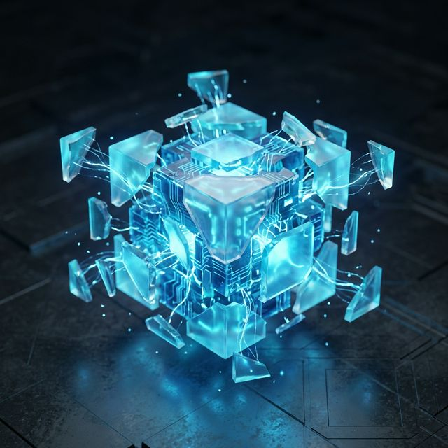

# 🤖 Automatizaciones IA - Landing Page

[](https://github.com/guillesrl/landing)
[](#)

Sistema experto de captación para servicios de automatización a medida enfocado en sectores locales como **Inmobiliarias, Estética, Peluquerías y Restaurantes**.



## 🚀 Características Premium

- **Aesthetica Dark Mode**: Interfaz premium con diseño "Glassmorphism" y micro-animaciones fluidas.
- **Copywriting de Alta Conversión**: Estructura basada en los frameworks **PAS** (Problemas-Agitación-Solución) y **AIDA**.
- **Visualización 3D**: Integración de elementos visuales dinámicos escalados mediante IA.
- **Mobile-First**: Optimización total para dispositivos móviles y tablets.
- **Performance**: Carga ultrarrápida sin dependencias externas pesadas.

## 🛠️ Stack Tecnológico

- **HTML5**: Estructura semántica y SEO optimizado.
- **Vanilla CSS**: Sistema de diseño personalizado con variables CSS, Blend Modes y Máscaras.
- **Git**: Control de versiones integrado.
- **Skills**: Construido siguiendo la metodología de la skill `landing-page-mastery`.

## 📁 Estructura del Proyecto

```bash
/
├── index.html                  # Página principal (Estructura y SEO)
├── index.css                   # Sistema de diseño y animaciones
├── landing_page_hero_bg.png    # Visual 3D principal (Cubo IA)
├── .gitignore                  # Exclusión de archivos innecesarios
└── skills/                     # Metodologías y referencias aplicadas
```

## 🌐 Despliegue

Este proyecto está optimizado para despliegues automáticos en herramientas como **Easypanel**, **Vercel** o **Netlify**.

1. Clona el repositorio: `git clone https://github.com/guillesrl/landing.git`
2. Abre `index.html` en tu navegador o levanta un servidor local: `npx serve .`

## 📧 Contacto

- **Email**: guillesrl@gmail.com
- **WhatsApp**: +376 615808
- **Web**: [github.com/guillesrl/landing](https://github.com/guillesrl/landing)

---
*Desarrollado con precisión técnica por Antigravity AI.*
